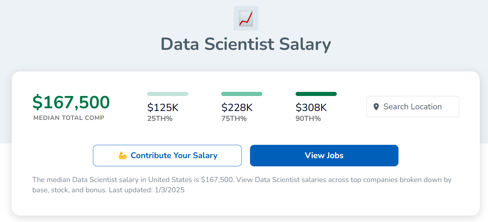
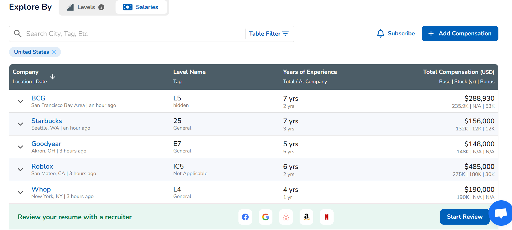
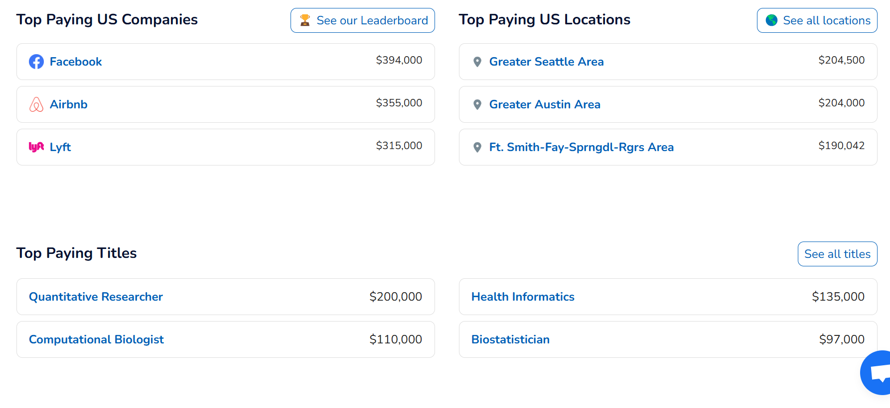

# rbiotechsalary

<!-- badges: start -->

<!-- badges: end -->

This repository holds the source code to produce rbiotechsalary web-app. There's two versions

1. web app hosted at app.victoryuan.com/rbiotechsalary 

- a digital ocean hosted docker rshiny web app

2. static html hosted at victoryuan.com/rbiotechsalary

- gha to pull new data and render a new html page everyday. OJS for interactivity

I initially started with 1., but it wasn't free (cheap though $5/month), and I had issues with deployment (css and routing headaches). 

I heard of OJS + quarto and was curious if I could make a functional web-app -like product without actually needing a server. But what I found was ultimately that OJS and quarto is not mature and stable enough to provide a featureful web-app like experience. Layout issues, interactivity bugs etc.

I think 2 is good for small projects, like simple data display. Not enough features and robustness for more in-depth data exploration.

Now I am back to working on improving 1.

# Next updates

- [ ] Remove data pulling and  cleaning into separate repo: wvictor14/rbiotechsalary.data, apps should just pull from there instead of running data cleaning everytime image or app is launched

- [ ] Related, web app receives data updates by manually redeploying / rebuilding docker image. Data is baked into the image itself. 

- [ ] Make web app more mobile friendly

    - I'd like to experiment with a more mobile friendly layout. Perhaps with a scrolling layout, and more data presented on one page using some other apps as inspiration
    - e.g. level.fyi for web-based layout
    - I like Monarch Money for the clarity in their UI

- [ ] additional features

- [ ] provide alternative survey
    - many issues with existing survey, particularly relating to location
    - a survey redesign would be best but wonder if there is something less atomic

### Overview

levels.fyi concise delivery of important info per title:



has a filter by location button


### Individual salary explorer:

levels.fyi has a good way of displaying data in table that is also mobile friendly:

- 4 columns, each column actually shows more data, organized in rows
- rows are expandable for more details
- table is filterable and searchable


### Top salaries by XX

levels.fyi section to explorer top salaries by location, company, title




# Docs

The repo is a bit messy and hard to understand because it comprises 3 components: data clean scripts, web-app (1.) and static html (2.).

1. and 2. depend on the data cleaning scripts

web app source lives in `inst/ext/app`

both utilize code in `R/`


## Installation

You can install the development version of rbiotechsalary from [GitHub](https://github.com/) with:

``` r
# install.packages("devtools")
devtools::install_github("wvictor14/rbiotechsalary")
```
# goals of this project

1. Provide user-friendly access to cleaned biotech salary information from r/biotech
   -  focus on normalizing the most relevant variables
3. Convey a minimal but relevant set of statistics and visualizations on salary information  
    - enable relevant queries with customized search based on normalized (cleaned) data for role titles, and location data  
4. Promote community involvement and open-source frameworks
    - allow user to explore raw data
    - open-access data provenance 

# Architecture

*Pipeline:*

Google survey -> google sheets -> GHA-powered daily render and publish

*Render and publish:*

- R / Observable JS / quarto backend
- renders static html
- github actions to publish static html to github pages 

*interactivity* is all client-side via Observable JS (ojs)

*data processing* is all using R


# Task list

## Ideas

? indicate still considering if worth

### deployment

- [x] dockerize
- [x] decide on hosting service - digital ocean
- [x] deploy
- [x] automate software updates
- [x] automate data updates
    - [ ] regular pulling updates from google sheets 
    - [ ] target pipeline
    - [x] automate new data cleaning and uploading

### General

-   [x] add research associate data
-   [ ] add other departments like product dev, clinical, business etc.

### For cleaning

Targeted minimum set of variables:

-   [x] timestamp
-   [x] role title
-   [x] location
-   [x] salary base
-   [x] salary bonus
-   [x] experience years

### For app

**Filters**

-   [x] add filter by location
-   [x] add filter by timestamp
    -   [x] select by year, or by all
-   [x] add filter by role title

**Salary graphs**

How to lay these out? by tabs?

-   [x] salary x experience
    - [x] raw data - cool
-   [x] histogram
    -   [ ] toggle between base / total
    -   [x] show median in text + line
    -   [x] show range (10th and 90th percentile?)

**Table**

-   [x] reactable winner over gt and DT -> server side processing, feature-ful and looks good
-   [x] show TC and breakdown base and bonus concisely - `merge_cols()`
-   [x] finalize column inclusion
    - [x] options good to include


# docker

for remembering how to docker:

```bash
docker container ls
docker exec -it <container_name> bash

# stop and remove
docker stop $(docker ps -a -q)
docker rm $(docker ps -a -q)

# build and push
docker build -t rbiotechsalary .
docker tag rbiotechsalary victor2wy/rbiotechsalary
docker push victor2wy/rbiotechsalary # push to dockerhub

# run
docker run --user shiny -dp 3838:3838 victor2wy/rbiotechsalary #dockerhub

docker pull victor2wy/rbiotechsalary:latest
docker run --user shiny -p 3838:3838  rbiotechsalary # local
```
